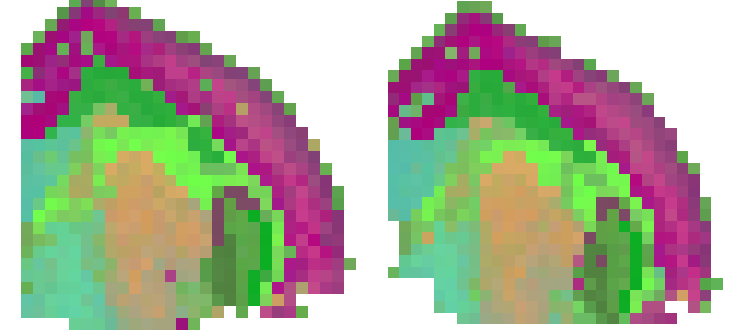
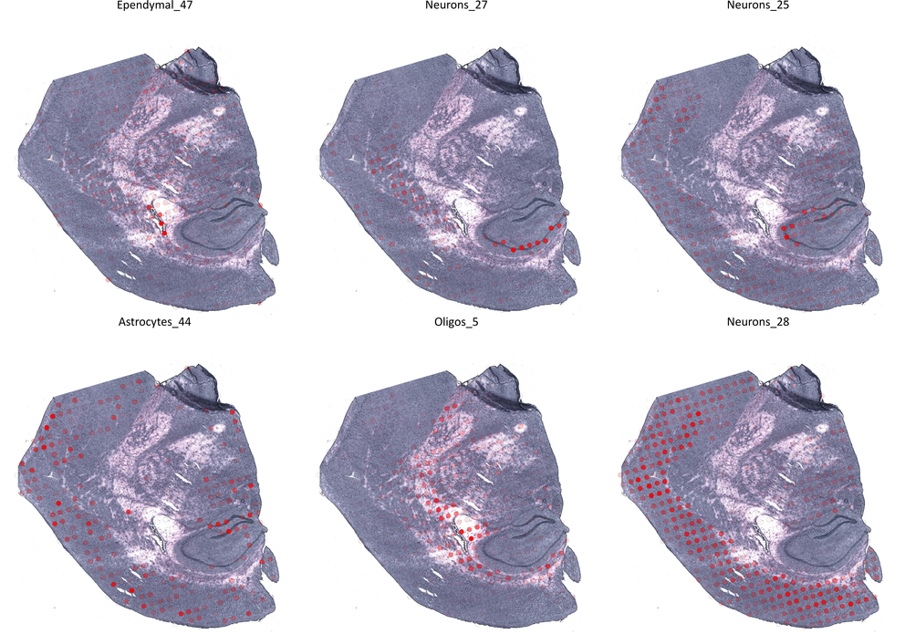
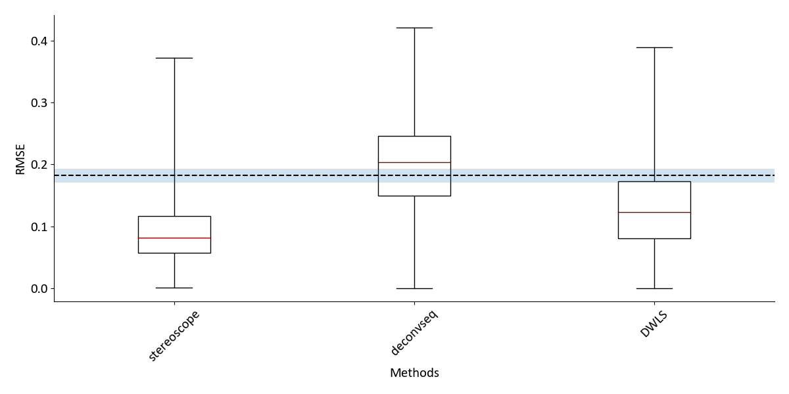
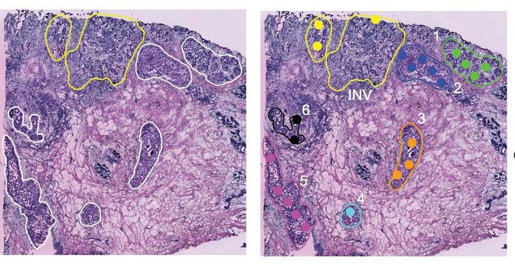

# Integration of Single Cell and Spatial Transcriptomics Data

This repository contains the Python package **stereoscope**, being the implementation of the method presented in the
paper. In addition, scripts used to preprocess, visualize and compare data/results presented in the paper are also found are also included.

Below you will find  examples of how to use stereoscope, whilst these are cast as a guide in how to reproduce the
results the procedure can of course be generalized and applied to any data set. The examples included are

1. [Reproducing the mouse brain analysis](#reprodmb): Conducting the complete analysis of the mouse brain presented in the paper,
   from downloading data to visualizing the results
2. [Reproducing the method comparison](#reprodcomp): Generation of synthetic data, running all three methods and comparing them
3. [Using pre-estimated parameters](#bc-add) : Examining four additional breast cancer samples, applying already
   estimated single cell parameters to a ST data set.

## Installing stereoscope
To make things easy for you, we have included installation files for stereoscope, a lot of scripts and some data sets in
this repo, thus we will begin by cloning it. Open your terminal and change to your desired
download directory - then enter the following:

```console
foo@bar:~$ git clone https://github.com/almaan/stereoscope 
```

Now let's start by installing stereoscope, you can easily do this by the following commands
```bash
foo@bar:~$ cd stsc
foo@bar:~$ ./setup install --user

```
This should give you access both to the stereoscope python package (stsc) and the stereoscope command line interface
(CLI) meaning you can conduct the analysis from the terminal. To make sure the installation was successfull, we
will run two tests:

```console
foo@bar:~$ python3 -c "import stsc; print(stsc.__version__)"
stereoscope : 0.2.0
foo@bar:~$ stereoscope test
successfully installed stereoscope CLI
```
If you cannot access stereoscope from the command line, and receive a message like
```console
foo@bar:~$ stereoscope test
bash stereoscope: command not found..

```

It means that your your install location is not a part of your PATH variable. Including the ```--user``` flag during
installation, should place your packages in  ~/.local directory. Thus a simple fix is possible by entering the follwing
into your terminal:

```console
foo@bar:~$ export PATH=$PATH:/user/home/.local/bin
```
NOTE : This a line you may want to consider adding to your ~/.bashrc file, or equivalent, for a more seamless usage in
the future - otherwise you will have to repeat every time you open a new terminal

Having installed stereoscope, we are ready to start with the analysis.

---

<a id="reprodmb"></a>

## Reproducing The Mouse Brain Analysis
Let us begin by reproducing the results presented for the mouse brain (hippocampal) region. Here we will go through the
whole workflow including downloading the data, preprocessing, analysis and visualization. If you aren't that keen on doing
the first parts and want to get started with the analysis part, you can skip step 1-2 and use the already processed
data found in the data/mousebrain folder, just unzip these files into a folder named data/curated.


### 1. Downloading the data
The data we used in the paper is downloaded from [mousebrain.org](http://mousebrain.org/tissues.html), where we
downloaded the loom-file containing cells from the Hippocampus. If you do not have loompy installed, please see
[this](http://loompy.org/) link for further instructions. You can either download the data set via the web browser, or the
terminal using :

```console
foo@bar:~$ cd data
foo@bar:~$ mkdir raw curated
foo@bar:~$ cd raw
foo@bar:~$ curl -O https://storage.googleapis.com/linnarsson-lab-loom/l1_hippocampus.loom  

```
### 2. Prepare Data

#### 2.1 Subsample Single Cell Data
We will subsample the single cell data, this is not a requirement, but it allows us to run the analysis a bit faster.
First we will create a modified loom-file where we have added a new column joining the ''Cluster'' and ''Class'' labels
together, this adds some interpretability to our labels compared to just using cluster indices. Enter the following in
the terminal:

```console
foo@bar:~$ ../../preprocess/hippocampus/create-mod-loom.py l1_hippocampus.loom .
successfully created modifed loom-file >> mod_l1_hippocampus.loom
```
Next we subsample out dataset, using a lower and upper bound (See Methods) of 25 repsectively 250 cells per
celltype. Do this by entering:

```console
foo@bar:~$ ../../preprocess/hippocampus/subsample-data.py -lf mod_l1_hippocampus.loom -o ../curated -lb 25 -ub 250 -cn
"Celltype_1"

Unique Identifier for set >> 20191029082957812352            
Astrocytes_13 | was discarded due to insufficient number of cells
Astrocytes_14 | Used 250 cells                               
Astrocytes_38 | was discarded due to insufficient number of cells
Astrocytes_39 | was discarded due to insufficient number of cells
Astrocytes_40 | Used 250 cells                               
Astrocytes_41 | Used 31 cells
Astrocytes_42 | Used 250 cells
Astrocytes_44 | Used 41 cells
....

```
This will create three files in the data/curated folder - a **count matrix** of the cells included in the set, a
**meta-file** containing their respective labels and a ''**stats-file**'' which displays the composition of the set. All
files belonging to the same set are marked with a unique identifier which is time and date-based (here :
20191029082957812352), your identifier will therefore be different from the one above. As you may notice, not all
''cell types'' were included, these types did not have more than 25 members (cells).

#### 2.2 ST-data
We have included the two sections of the mouse brain used in the paper as .tsv files in the repo, there is no need to
preprocess these - but we have zipped them to save some space. Unzip these files and place in the data/curated folder as
well - either interactively or for example entering the following into the terminal:

```console
foo@bar:~$ basename $( pwd )
curated
foo@bar:~$ unzip ../mouse_brain/mouse-st-data.zip -d .
Archive:  ../mouse_brain/mouse-st-data.zip
  inflating: ./st-hippo1.tsv         
  inflating: ./st-hippo2.tsv         
```

If all steps have been successfull, this (below) is the content which you should have within the data/curated folder

```console
foo@bar:~$ ls -1
20191029082957812352.cnt_data.tsv
20191029082957812352.mta_data.tsv
20191029082957812352.stats.tsv
st-hippo1.tsv
st-hippo2.tsv

```
#### 2.3 Format data
The ouput from the subsampling and the ST data that we provide you with will already be given in the correct format,
hence you will not have to do any additional work. However, we will shortly describe what type of files are required and
how they should be formatted in order to run stereoscope : 

* **Single Cell Count Data File** - A .tsv file with cells as rows and genes as columns, each cell (row) should have a unique label
* **Single Cell Annotation Data** - A .tsv file with the same rownames as the count data file, either with one single column
  listing the annotations, or multiple columns where the column containing the labels should be named 'bio_celltype'
* **Spatial Transcriptomics (ST) Count Data** - A .tsv file containing with spots as rows and genes as columns

Some additional thing to keep in mind are:
* Make sure that your ST and single cell data uses the same gene identifiers. For example, having one set using ENSEMBL ids whilst
  the other one has HGNC gene symbols will not work. However as long as the ids match, stereoscope can work with _any_
  type of identifiers.
* Do **not normalize** your data - the model relies on using raw count data, your gene counts should be thus always be
  integer numbers.


## 3. Analysis

### 3.1 Run the analysis
Now when the data is prepared, we can run the actual analysis. We will run the complete analysis,  estimating rates and
logits from the single cell data and then using these to infer the proportion values in our spatial data. We will use
the following specifics in our analysis

| parameter | values |
| --- | --- |
| number of genes | 5000 |
| sc epochs | 75000 |
| sc batch size | 100 |
| st epochs | 75000
| st batch size | 100|
| learning rate | 0.01|
| gpu | True |

To run the analysis enter the following into your terminal :

```console
foo@bar:~$ cd ../../res
foo@bar:~$ stereoscope run --sc_cnt ../data/curated/*cnt*.tsv --sc_labels ../data/curated/*mta*.tsv -sce 75000  -o hippo_1 -n 5000 --st_cnt ../data/curated/st-hippo*tsv -ste 75000 --gpu -stb 100 -scb 100
[2019-10-29 09:07:50,891 - stsc - INFO ] >> Using device cuda
[2019-10-29 09:07:50,891 - stsc - INFO ] >> fitting sc data | count file : ../data/curated/20191029082957812352.cnt_data.tsv | labels file : ../data/curated/20191029082957812352.mta_data.tsv                                                                                 
[2019-10-29 09:09:51,527 - stsc - INFO ] >> SC data GENES : 5000  SC data CELLS : 8449  SC data TYPES : 56

Epoch : 211  /75000 | Loss : 3.004263E+07 | [                     ]
```
This will create a subfolder named "hippo_1" in the res folder, where all results,logs and data related to this analysis
will eventually be found.

For more information regarding which arguments and configurations you can make to your analysis use
```console
foo@bar:~$ stereoscope run -h
```

### 3.2 Supervising the progress

Even with a GPU the analysis will take some time to complete. Whilst the progress bar shows the current
status - it's also of interest to put this into a broader perspective and track the progress
over time. We can do so by the following command :

```
foo@bar:~$ stereoscope progress -lf hippo_1/sc_loss*txt & disown

```
This will open up a matplotlib interactive window, where you can zoom and move around. The plot will be updated every 10
seconds where you can see how the loss has changed over time. Appending ```& disown``` to the command, allows us to keep
on using the same terminal window and won't kill the job if we were to exit, if your shell does not support
the ```disown``` command you can try ```nohup``` instead (to be put before the command rather than after). Below is just
an example of what the plot would look like


### 4. Inspection of Results

#### 4.1 Orienting the results

Upon completeion of the analysis. The folder ```res/hippo_1``` folder should contain the following set of files :
```console
foo@bar:~$ ls -1
logits.2019-10-29090750.880065.tsv
R.2019-10-29090750.880065.tsv
sc_loss.2019-10-29090750.880065.txt
sc_model.2019-10-29090750.880065.pt
st-hippo1
st-hippo2
st_loss.2019-10-29090750.880065.txt
st_model.2019-10-29090750.880065.pt
stsc.2019-10-29090750.880065.log
```
With the subfolder content being :
```console
foo@bar:~$ ls st-hippo*/ 
st-hippo1/:
W.2019-10-29090750.880065.tsv

st-hippo2/:
W.2019-10-29090750.880065.tsv

```

These ''W-files'' are the results that we are interested in, every section has its own ouput folder,
whilst the proportion estimate names are shared. These files are given in a matrix format [n_spots x n_types] where each
element represent the proportion of a cell type within a specific spot. To further illustrate :

```console
foo@bar:~$ head st-hippo1/W*tsv -n 5 | cut -f 1-5 | column -t
               Astrocytes_14  Astrocytes_40  Astrocytes_41  Astrocytes_42  
4.83x31.08     0.017654551    0.019365933    0.021137744    0.019530216
19.98x24.93    0.020201972    0.017161706    0.016906356    0.017648073
15.87x9.01     0.017025681    0.017077405    0.016912553    0.016671246
5.83x27.97     0.019220736    0.018679986    0.017026993    0.017045338
```

Whilst one could justify the usage of a ''threshold''; for example setting all proportions lower than
a certain value to zero and renormalize. We prefer not to adjust results and keep all values.

**4.2 Visualization**

We include a tool for quick visualization of the results in the stereoscope package - to run this simply do:

```console
foo@bar:~$ stereoscope look -pp st-hippo*/W*tsv -o viz -sc i -sb s -nc 7 -c "umap" -g -ms 40
```
This will generate two types of images, saved to the folder ''viz''

1. _Separate visualizations_ : spots are plotted according to their array coordinates, and the intensity of their
blue facecolor corresponds to the proportion value of _each_ celltype. All of these plots are scaled internally (this highlights the
spatial patterns, but does not allow for comparison of abundance), but chancing the argument  ```-sc i``` to ```-sc s```
will scale all values within each section.

2.  _Joint visualizations_ : These are the type of ''compressed'' images described in the Method and found within the
    supplementary. Here regions of similar colors have a similar cell type composition. The method used for the
    dimensionality reduction is umap, but you can also choose between pca (slightly faster) and tsne (much slower).

Below you see some examples of the generated images:




You can customize the output of ```stereoscope look```in multiple ways by providing certain arguments, for more
information run 
```console
foo@bar:~$ stereoscope look -h

```

For a more informative visualization you could also overlay the spots on the tissue image, to see how the spatial patterns
relates to the morphology, like we did in our figures. This type of visualization is not a part of the stereoscope package,
but we do provide scripts for this.

The material that you need for such visualization is:
* HE-image - image taken of the tissue, can be scaled but not cropped
* Transformation Matrix - matrix that maps spot coordinates to pixel coordinates
* Proportion Estimates - output from stereoscope analysis
* Mask (optional)- mask to indicate which parts of the are to be included (transparent) resepectively excluded (black)

We actually use resized images (30% downscaled), since the original images are unnecessarily large for our
intents. Still being in the res folder, all you have to do is run:

MODIFY COMMMAND 
```console
foo@bar:~$ ./map2he.py -i ../data/mouse/rsc/st-hippo1.jpg -t ..data/mouse/rsc/st-hippo1-tmat.txt -p st-hippo1/W*tsv -sf 0.3 -si -o he_overlay

using image file ../data/mouse/rsc/st-hippo1.jpg
using proportions file st-hippo1/W.2019-10-29090750.880065.tsv
Rendering type Astrocytes_14
Rendering type Astrocytes_40
....
```

Resulting in images like these (we rotated these images in our paper):



<a id="reprodcomp"></a>
## Reproducing the Method Comparion
In the paper we compare stereoscope with two other methods [DWLS](https://github.com/dtsoucas/DWLS) and
[deconvSeq](https://github.com/rosedu1/deconvSeq) using synthetic data. This comparison is something we will reproduce
in this section.

### 1. Generating Synthetic Data
Begin by unzipping the file data/comp/comp-data.zip into the data/comp/ folder

```
foo@bar:~$ cd data/comp
foo@bar:~$ unzip comp-data.zip 
foo@bar:~$ ls -1

comp-data.zip

real:
ori-sc-cnt.tsv
ori-sc-mta.tsv

synthetic:
generation.20190908194059502947.cnt_data.tsv
generation.20190908194059502947.mta_data.tsv
generation.20190908194059502947.stats.tsv
proportions.hippo.tsv
st-counts.hippo.tsv
validation.20190908194059502947.cnt_data.tsv
validation.20190908194059502947.mta_data.tsv
validation.20190908194059502947.stats.tsv

```
As you can see, there is already a set of synthetic data available, you can use this data if you'd like to - if so, then move
ahead to step 2. However we will go through the full procedure here. 

Begin by removing the prepared data, just to not mix things up :

```console
foo@bar:~$ rm synthetic/*
```

We first  to split our single cell data into a ''generation'' and ''validation'' set, preferably of equal size.
The single cell data set we use stems from the same hippocampus set we used in the previous example, but where we
subsampled w.r.t. to _Subclass_ labels rather than cluster labels.

```console
foo@bar:~$ ../../comparison/synthetic_data_generation/make_sc_sets.py real/hippo-real-sc-cnt.tsv real/hippo-real-sc-mta.tsv synthetic

```
You should now have the following four files in your synthetic folder :
```console
foo@bar:~$ ls -1 synthetic/
generation.20190908194059502947.cnt_data.tsv
generation.20190908194059502947.mta_data.tsv
validation.20190908194059502947.cnt_data.tsv
validation.20190908194059502947.mta_data.tsv
```
We will use the ''generation'' set to generate synthetic ST data. We'll compose a set containing  1000 spots and 500
genes. To easily keep track of our files we tag them with "st-hippo-comp". The validation set is set aside, in order to
later be used as single cell data input to each respective method upon deconvolution.

```console
foo@bar:~$ ../../comparison/synthetic_data_generation/make_st_set.py -c synthetic/generation.20190908194059502947.cnt_data.tsv -l synthetic/generation.20190908194059502947.mta_data.tsv -ns 1000 -ng 500 -o synthetic -t st-hippo-comp

```
A total of three files will be generated  - ST expression data (counts), proportion values (proportions) and the number
of cells (members). Since we know the actual proportions (ground truth) of cell types within each spot, this type of data can be used
to compare the performance of different methods.

```console
foo@bar:~$ ls -1 synthetic/
counts.st-hippo-comp.tsv
generation.20190908194059502947.cnt_data.tsv
generation.20190908194059502947.mta_data.tsv
members.st-hippo-comp.tsv
proportions.st-hippo-comp.tsv
validation.20190908194059502947.cnt_data.tsv
validation.20190908194059502947.mta_data.tsv

```

### 2. Running stereoscope
We will run stereoscope with the following arguments (see previous section for more details regarding the stereoscope
interface):

```console
foo@bar:~$ stereoscope run --sc_cnt synthetic/valid*cnt* --sc_labels synthetic/valid*mta* -scb 256 \ 
-sce 50000 --st_cnt synthetic/counts.st-hippo-comp.tsv -ste 50000 -o ../res/comp-stereoscope \
--gpu -lr 0.1

```

Where the results will be saved to ```comp-stereoscope``` in the ```res``` folder

### 3. Running other methods

Since none of the other two methods were designed with ST data in mind, we have written ''wrappers'' for them to use ST
data as input and render similar output files to steroscope. 

**DWLS**

Small modifications were made to the DWLS code, since some of the provided functions crashed upon usage, these changes
were however minor and does not affect the method itself. We provide a ''modded'' version of their file
''Deconvolution_functions.R'' the two modifications we made are marked with the tag ```#MODIFICATION``` within the code.
Using Seurat for the DE-analysis was not successfull, thus we choose the second alternative, MAST.  Negative values are
also given for some proportions, we take all of these to be equal to zero. 

To run DWLS go to the main directory of the repo and enter

```console
foo@bar:~$ comparison/alternative_methods/DWLS/DWLS-implementation.R -wd res/comp-DWLS \
-sc data/comp/synthetic/validation*cnt_data.tsv -mt data/comp/synthetic/validation.*.mta_data.tsv \
-st data/comp/synthetic/counts*.tsv 
```

**deconvSeq**

We followed the instructions given in the [HTML-Vignette](https://rosedu1.github.io/deconvSeq/deconvSeq_vignette.html)
for deconvSeq, in order to estimate the proportions - no cell cycle filtering is performed.

To run deconvSeq got the main directory of the repo and enter :

```console
foo@bar:~$ comparison/alternative_methods/deconvSeq/deonvSeq-implementation.R \
 -sc data/comp/synthetic/validation.*.cnt_data.tsv \
 -mt data/comp/synthetic/validation.*.mta_data.tsv \ 
 -st data/comp/synthetic/counts.*.tsv -o res/comp-deconvSeq
```
We noticed that sometimes the bioMart-dependent functions did not successfully execute, if such an error arise wait a
minute and try again.

### 4. Comparing performance

Having estimated the proportions using all three methods, we can now compare them. To do so we compute the RMSE between
the actual proportion values within each spot and the estimated values. We visualize these values in a boxplot, and
conduct a one-sided test ([Wilcoxon signed-rank
test](https://docs.scipy.org/doc/scipy/reference/generated/scipy.stats.wilcoxon.html)) to see whether stereoscope performs better than the other methods.

```console
foo@bar:~$ comparison/compare.py -rf  res/comp-stereoscope/*/W*tsv res/comp-DWLS/proportions.tsv res/deconvSeq-proportions.tsv \
 -tf data/comp/synthetic/proportions.hippo.tsv -o res/comp -mn stereoscope DWLS devonvSeq

```
Which will generate a image like the follwing :



Where the dashed line represents the performance upon randomly sampling propotrions from a homogenous Dirichlet
distribution (concentration 1), the shaded blue region represent the 95% confidence interval.

<a id="bc-add"></a>
## Using pre-estimated parameters
Occasionaly you might encounter a scenario where you have run steroscope in a previous analysis and now want to use the
same single cell data set but different (or more) ST data. The way we have implemented our method and built stereoscope
allows you to this in a seamless manner.

To exemplify - we looked at breast cancer using one ST section and a curated Lung Cancer single cell data set. But
perhaps we have another set of ST breast cancer data which we would like to map the very same single cell data to.

In the original ST [publication](https://science.sciencemag.org/content/353/6294/78.long) 12 MOB (Mouse Olfactory Bulb) and 4 Breast Cancer sections were presented, let us analyze
the breast cancer samples using the Lung Cancer Data set.



Above you see parts of Figure 4 in the original publication, displaying some of the breast cancer tissue.

### 1. Downloading data
The data is available at
[this](https://www.spatialresearch.org/resources-published-datasets/doi-10-1126science-aaf2403/) link, download the four
breast cancer samples and put them in ```data/add-bc``` either interactively (make sure to rename them as below) or using the terminal.

```console
foo@bar:~$ cd data
foo@bar:~$ mkdir add-bc
foo@bar:~$ cd add-bc
foo@bar:~$ for ii in 1 2 3 4; do curl https://www.spatialresearch.org/wp-content/uploads/2016/07/Layer${ii}_BC_count_matrix-1.tsv --output st-bc${ii}.tsv; done
```
Once the download is done you should have the following content in your ```data/add-bc``` folder:

```console
foo@bar:~$ ls -1
st-bc1.tsv
st-bc2.tsv
st-bc3.tsv
st-bc4.tsv
```

This files are already processed, only having spots under the tissue and uses HGNC gene symbols - hence there is no need
to pre-process our data.

### 2. Running stereoscope

Now you can find the estimated single cell parameters (rates and logits) for the Lung Cancer data set within
```data/params-lc``` folder. To use these in conjuction with the newly downloaded breast cancer ST data simply do : 

```console
foo@bar:~$ stereoscope run --sc_fit ../params-lc/R*.tsv ../params/logits*.tsv --st_cnt st-bc*.tsv --ste 50000 -stb 256 -lr 0.01 --gpu -o ../../res/bc-add

```

The flag  ```--sc_fit``` expects two positional arguments, the first being the path to the rates and the second being
the path to the logits.

### 3. Visualization
We can visualize the resullts by using the ```look``` module of stereoscope (see above for more detailed description).
This is simply done by :

```con
foo@bar:~$ cd ../../res/bc-add
foo@bar:~$ stereoscope look -pp bc*/W*tsv -ms 80 -nc 2 -sc i -sb s -c "umap" -g -o viz
```
Which will generate a set of images like these : 
