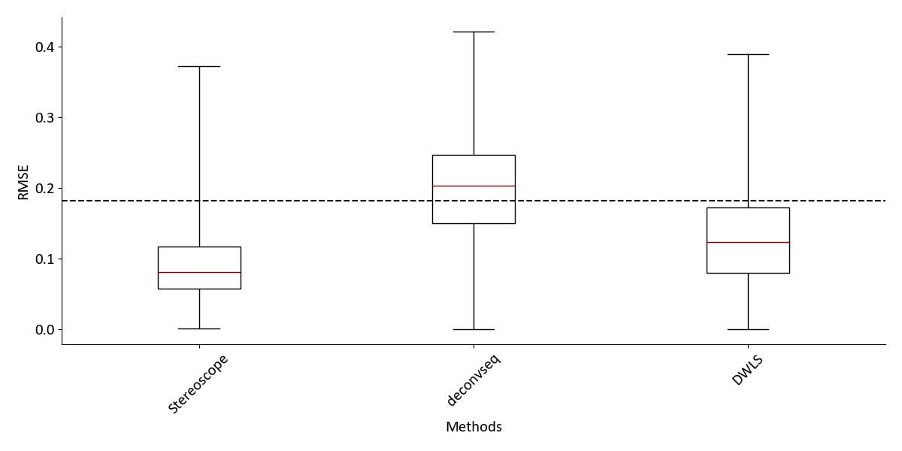
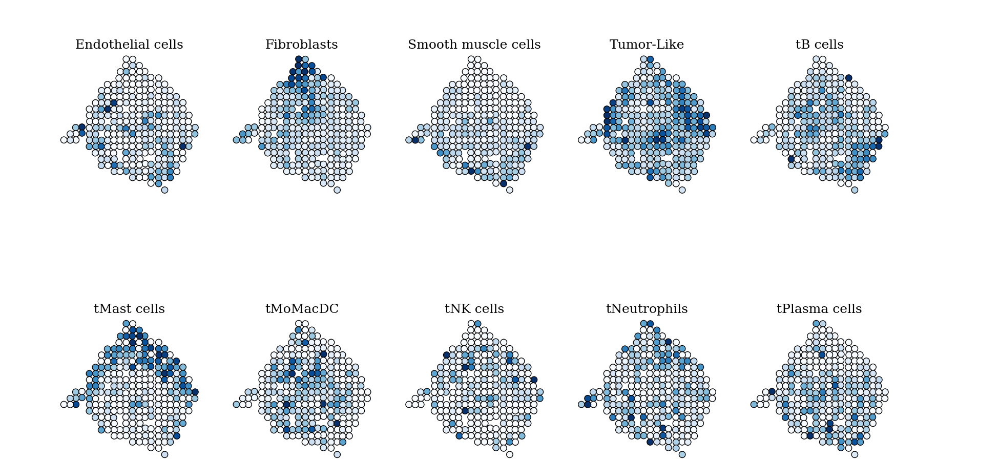

# Spatial mapping of cell types by integration of transcriptomics data

This repository contains the Python package **stereoscope**, which is the implementation of the method presented in the
paper. In addition, scripts used to: preprocess, visualize, and compare results presented in the paper are also included.

Below examples illustrating how to use Stereoscope can be found. While some of these examples are cast as a guides to reproduce the
results presented in the paper, they can easily be generalized and applied to any data set. The three examples are: 

1. [Reproducing the mouse brain analysis](#reprodmb): Conducting the complete analysis of the mouse brain presented in the paper,
   from downloading data to visualization of the results
2. [Reproducing the method comparison](#reprodcomp): Generation of synthetic data, running all three methods and comparing them
3. [Using pre-estimated parameters](#bc-add) : Examining four additional breast cancer samples, applying already
   estimated single cell parameters to set of ST data.

_Note: While the ST data will be publicly available upon publication, these files are currently password
protected - access will be given to reviewers._

## Installing stereoscope
In order to install `stereoscope`, we begin by cloning this very repository.
Open your terminal and go to your desired download directory - then enter
the following:

```console
foo@bar:~$ git clone https://github.com/almaan/stereoscope 
```

Now to actually install Stereoscope, just use the provided `setup.py` file. If you are working
with conda or virtual environments, this is where you should create and source a
new environment.

the following commands
```bash
foo@bar:~$ cd stereoscope
foo@bar:~$ ./setup.py install --user

```
Assuming the installation was successful, you should now have access to both the stereoscope python package (stsc) and the `stereoscope` command line interface
(CLI) meaning you can conduct the analysis from the terminal. To confirm that the installation was successful, we
will run two tests, which are:

```console
foo@bar:~$ python -c "import stsc; print(stsc.__version__)"
stereoscope : 0.2.0
foo@bar:~$ stereoscope test
successfully installed stereoscope CLI
```
If you cannot access stereoscope from the command line, and receive a message stating something similar to:
```console
foo@bar:~$ stereoscope test
bash stereoscope: command not found..

```

This means that your install location is not a part of the PATH variable.
Including the ```--user``` flag during installation should place your packages
in your `~/.local` directory. Thus, this issue may be resolved by entering the
following into your terminal:

```console
foo@bar:~$ export PATH=$PATH:/user/home/.local/bin
```

Having installed `stereoscope`, we are now ready to start with the analysis.

---

<a id="reprodmb"></a>

## Reproducing The Mouse Brain Analysis
Let us begin by reproducing the results presented for the mouse brain (Hippocampal region), to briefly remind you what
that means; we will analyze two (1k) ST-sections of the mouse brain (jointly) and map single cell data from the resource
[mousebrain.org](http://mousebrain.org) onto it. Here we will go through the whole workflow including downloading the
data, preprocessing, analysis and visualization. If you aren't that interested in the first parts and want to get
started with the analysis, you can skip step 1-2 and use the already processed data found in the
`data/mousebrain` folder. Simply unzip these files into a folder named `data/curated`.


### 1. Downloading the data
As mentioned above, the data we used in the paper is downloaded from [mousebrain.org](http://mousebrain.org/tissues.html). More specifically, we
used the `loom`-file containing cells from the Hippocampus region. If you do not have `loompy` installed, we refer you to
[this](http://loompy.org/) link for further instructions. You can either download the data set via the web browser, or the
terminal using :

```console
foo@bar:~$ cd data
foo@bar:~$ mkdir raw curated
foo@bar:~$ cd raw
foo@bar:~$ curl -O https://storage.googleapis.com/linnarsson-lab-loom/l1_hippocampus.loom  

```
### 2. Prepare Data

#### 2.1 Subsample Single Cell Data
We will subsample the single cell data, this is not a requirement, but it allows us to run the analysis a bit faster.
First we create a modified `loom`-file where a new set of labels is introduced, formed by joining the _Cluster_ and _Class_ labels
together, this adds (some) context to our labels compared to just using cluster indices. Enter the following in
the terminal:

```console
foo@bar:~$ ../../preprocess/hippocampus/create-mod-loom.py l1_hippocampus.loom .
successfully created modifed loom-file >> mod_l1_hippocampus.loom
```
Next, we subsample our data set. We use a lower and upper bound (See Methods) of 25 repsectively 250 cells per
cell type. Do this by entering:

```console
foo@bar:~$ ../../preprocess/hippocampus/subsample-data.py -lf mod_l1_hippocampus.loom -o ../curated -lb 25 -ub 250 -cn
"Celltype_1"

Unique Identifier for set >> 20191029082957812352            
Astrocytes_13 | was discarded due to insufficient number of cells
Astrocytes_14 | Used 250 cells                               
Astrocytes_38 | was discarded due to insufficient number of cells
Astrocytes_39 | was discarded due to insufficient number of cells
Astrocytes_40 | Used 250 cells                               
Astrocytes_41 | Used 31 cells
Astrocytes_42 | Used 250 cells
Astrocytes_44 | Used 41 cells
....

```
This will create three files in the data/curated folder - a **count matrix** of the cells included in the set, a
**meta-file** containing their respective labels and a ''**stats-file**'' which displays the composition of the set. All
files belonging to the same set are marked with a unique identifier which is time and date-based (here :
20191029082957812352), your identifier will therefore be different from the one above. As you may notice, not all
''cell types'' are listed; since we specified a lower bound, all types with fewer than 25 members (cells) are excluded.

#### 2.2 ST-data
We have included the two mouse brain sections presented in the paper as `.tsv` files in the repo. You do not need to
preprocess these, but we have zipped them to reduce the file sizes. Unzip these files and place them in the `data/curated` folder, you could do this
either interactively or for example by entering the following command into the terminal :


```console
foo@bar:~$ 7z e mouse-st-data.zip

7-Zip [64] 16.02 : Copyright (c) 1999-2016 Igor Pavlov : 2016-05-21

Scanning the drive for archives:
1 file, 7254353 bytes (7085 KiB)

Extracting archive: mouse-st-data.zip
--
Path = mouse-st-data.zip
Type = zip
Physical Size = 7254353

    
    Enter password (will not be echoed):
....

foo@bar:~$ mv st-hippo*tsv curated/
```
If all steps were successfull, this (below) should be representative of the content in your `data/curated` folder

```console
foo@bar:~$ ls -1 curated/*
20191029082957812352.cnt_data.tsv
20191029082957812352.mta_data.tsv
20191029082957812352.stats.tsv
st-hippo1.tsv
st-hippo2.tsv

```
#### 2.3 Data Formatting
The output from the subsampling and the ST-data we provided you with are given in the correct formats,
hence you will not have to do any additional work. However, we will briefly describe what type of files are required and how they should be formatted in order to run `stereoscope` : 

* **Spatial Transcriptomics (ST) Count Data**
  * Alt1 - a `.tsv` file with spots as rows and genes as columns
  * Alt2 - a `.h5ad` file with capture locations as observations (rows) and genes as variables (columns)
* **Single Cell Count Data File** 
  * Alt1 - a `.tsv` file with cells as observations (rows) and genes as variables (columns), each cell (row) should have a unique label
  * Alt2 - a `.h5ad` file with cells as rows and genes as columns. Cell type annotations can be read from this file as well, and should then be put in the `.obs` slot. See Alt2 below for more information.
* **Single Cell Annotation Data**
  * Alt1 - a `.tsv` file with the same rownames as the count data file, either with one single column
  listing the annotations, or multiple columns where the column containing the labels should be named 'bio_celltype**.
  * Alt2 - use labels from `.h5ad` file. Make sure your labels are located in the `.obs` slot and then use the flat `--label_colname KEY` to indicate what the key to access these labels is (i.e., `KEY`).

**NOTE** : The `h5ad` support is still in beta. If you are experiencing any problems, we'd be tremendously happy if you'd let us know by posting an issue!

Some additional things to keep in mind are:
* Make sure that your ST and single cell data use the same gene identifiers. For example, if one set uses _ENSEMBL_ ids while the other one uses _HGNC_ gene symbols, this will raise an error. However as long as the ids match, `stereoscope` is agnostic to the type of identifiers used.
* Do **not normalize** your data - the model relies on using raw count data, your gene counts should thus always be
  integer numbers.
* When using `h5ad` files, the index values of the `var` and `obs` slots will be used as gene (`var.index`) and capture location (`obs.index`) identifiers.

## 3. Analysis

### 3.1 Run the analysis
Now when the data has been prepared, we are ready to use `steroscope`. We will run the complete analysis, estimating rates and
logits from the single cell data and then use these to infer the proportion values in our spatial data. We use the following
specs:

| parameter | values |
| --- | --- |
| number of genes | 5000 |
| sc epochs | 75000 |
| sc batch size | 100 |
| st epochs | 75000
| st batch size | 100|
| learning rate | 0.01|
| gpu | True |

To run the analysis enter the following into your terminal :

```console
foo@bar:~$ cd ../../res
foo@bar:~$ stereoscope run --sc_cnt ../data/curated/*cnt*.tsv --sc_labels ../data/curated/*mta*.tsv -sce 75000  -o hippo_1 -n 5000 --st_cnt ../data/curated/st-hippo*tsv -ste 75000 --gpu -stb 100 -scb 100
[2019-10-29 09:07:50,891 - stsc - INFO ] >> Using device cuda
[2019-10-29 09:07:50,891 - stsc - INFO ] >> fitting sc data | count file : ../data/curated/20191029082957812352.cnt_data.tsv | labels file : ../data/curated/20191029082957812352.mta_data.tsv                                                                                 
[2019-10-29 09:09:51,527 - stsc - INFO ] >> SC data GENES : 5000  SC data CELLS : 8449  SC data TYPES : 56

Epoch : 211  /75000 | Loss : 3.004263E+07 | [                     ]

```
This will create a subfolder named `hippo_1` in the `res` folder, where all results, logs and data related to this analysis
will eventually be located.

For more information regarding which arguments and configurations you can make to your analysis use:
```console
foo@bar:~$ stereoscope run -h
```

### 3.2 Monitoring progress

Even with GPU resources the analysis will take some time to complete. While the progress bar shows the current
status - it's also of interest to put this into context and track the progress
over time. We can do so by using the `progress` module accordingly:

```
foo@bar:~$ stereoscope progress -lf hippo_1/sc_loss*txt & disown

```
This will open up a interactive window, where you can zoom and move around. The plot will be updated every 10
seconds, allowing you to see how the loss changes over time. Appending `& disown` to the command, allows us to keep
using the same terminal window. Below is an example of what the progress-plot may look like.


### 4. Inspection of results

#### 4.1 Orienting the results

Upon completeion of the analysis. The folder `res/hippo_1` folder should contain the following set of files:

```console
foo@bar:~$ ls -1
logits.2019-10-29090750.880065.tsv
R.2019-10-29090750.880065.tsv
sc_loss.2019-10-29090750.880065.txt
sc_model.2019-10-29090750.880065.pt
st-hippo1
st-hippo2
st_loss.2019-10-29090750.880065.txt
st_model.2019-10-29090750.880065.pt
stsc.2019-10-29090750.880065.log
```
With the subfolder content being:
```console
foo@bar:~$ ls st-hippo*/ 
st-hippo1/:
W.2019-10-29090750.880065.tsv

st-hippo2/:
W.2019-10-29090750.880065.tsv

```

The _W-files_ contain the proportion estimates, and thus what we are mainly interested in. Every section has its own ouput folder,
while the W-files share the same name. These files are given in a matrix format `n_spots x n_types` where each
element represents the proportion of a cell type within a specific spot. To further illustrate :

```console
foo@bar:~$ head st-hippo1/W*tsv -n 5 | cut -f 1-5 | column -t
               Astrocytes_14  Astrocytes_40  Astrocytes_41  Astrocytes_42  
4.83x31.08     0.017654551    0.019365933    0.021137744    0.019530216
19.98x24.93    0.020201972    0.017161706    0.016906356    0.017648073
15.87x9.01     0.017025681    0.017077405    0.016912553    0.016671246
5.83x27.97     0.019220736    0.018679986    0.017026993    0.017045338
```

We could justify the usage of a "threshold", for example setting all proportions lower than
a certain value to zero. We will not to adjust our results and keep all values as they are.

**4.2 Visualization**

We include a tool (the `look` module) for seamless visualization of the results generated by `stereoscope`. To use `look` do:

```console
foo@bar:~$ stereoscope look -pp st-hippo*/W*tsv -o viz -sc i -sb s -nc 7 -c "umap" -g -ms 40
```
This will generate two types of images, saved to the folder `viz`

1. _Separate visualizations_ : spots are plotted according to their array coordinates, and the intensity of their
blue facecolor corresponds to the proportion value of _each_ celltype. All of these plots are scaled internally (this highlights the
spatial patterns, but is not suitable for comparisons), changing the argument  `-sc i` to `-sc s`
will scale all values within each section.

2.  _Joint visualizations_ : These are the type of "compressed" images described in the paper's _Method_. This type of visualization is found in the 
    Supplementary. Regions of similar colors have a similar cell type compositions. The method used for the
    dimensionality reduction is `umap`, but you can also choose between `pca` (slightly faster) and `tsne` (much slower).

Below are some examples of the generated images:


You can customize the output of `stereoscope look` in multiple ways by providing certain arguments, for more
information run:

```console
foo@bar:~$ stereoscope look -h

```

One could also overlay the spots on the tissue image, to see how the spatial
patterns relates to the morphology, like we did in our figures. This type of
visualization is not a part of the `stereoscope` package, but we do provide
scripts for this.

The material that you need for this would be:
* HE-image - image taken of the tissue, can be scaled but not cropped
* Transformation Matrix - matrix that maps spot coordinates to pixel coordinates
* Proportion Estimates - output from `stereoscope` analysis
* Mask (optional)- mask to indicate which parts of the area to be included (transparent) resepectively excluded (black)

We actually use resized images (30% downscaled), since the original images are
unnecessarily large.

Still being in the `res` folder, all you have to do is run:

```console
foo@bar:~$ ./map2he.py -i ../data/mouse/rsc/st-hippo1.jpg -t ..data/mouse/rsc/st-hippo1-tmat.txt -p st-hippo1/W*tsv -sf 0.3 -si -o he_overlay

using image file ../data/mouse/rsc/st-hippo1.jpg
using proportions file st-hippo1/W.2019-10-29090750.880065.tsv
Rendering type Astrocytes_14
Rendering type Astrocytes_40
....
```

Resulting in images like these (we rotated these images in our paper):


<a id="reprodcomp"></a>
## Reproducing the Method Comparion
In the paper we compare `stereoscope` with two other methods [DWLS](https://github.com/dtsoucas/DWLS) and
[deconvSeq](https://github.com/rosedu1/deconvSeq) using synthetic data. This comparison is something we will reproduce
in this section.

### 1. Generating Synthetic Data
Begin by unzipping the file ```data/comp/comp-data.zip``` into the ```data/comp/``` folder

```
foo@bar:~$ cd data/comp
foo@bar:~$ unzip comp-data.zip 
foo@bar:~$ ls -1

comp-data.zip

real:
hippo-real-sc-cnt.tsv
hippo-real-sc-mta.tsv

synthetic:
counts.st-hippo-comp.tsv
generation.20190908194059502947.cnt_data.tsv
generation.20190908194059502947.mta_data.tsv
members.st-hippo-comp.tsv
proportions.st-hippo-comp.tsv
validation.20190908194059502947.cnt_data.tsv
validation.20190908194059502947.mta_data.tsv

```
As you can see, there is already a set of synthetic data available; you can use this data if you'd like to, if so, then move
ahead to step 2. We will however go through the full procedure for generation of these files.

Begin by removing the prepared data, to make sure we don't mix thing up :

```console
foo@bar:~$ rm synthetic/*
```

We first split our single cell data into a "generation" and ''validation'' set, preferably of equal size.
The single cell data is the same Hippocampus set we used in the previous example. The only difference is that we
subsampled w.r.t. to _Subclass_ labels rather than _Cluster_ labels.

```console
foo@bar:~$ ../../comparison/synthetic_data_generation/make_sc_sets.py real/hippo-real-sc-cnt.tsv real/hippo-real-sc-mta.tsv synthetic

```
You should now have the following four files in your `synthetic` folder :
```console
foo@bar:~$ ls -1 synthetic/
generation.20190908194059502947.cnt_data.tsv
generation.20190908194059502947.mta_data.tsv
validation.20190908194059502947.cnt_data.tsv
validation.20190908194059502947.mta_data.tsv
```
We will use the "generation" set to generate synthetic ST data. As in the paper we use 1000 spots and 500
genes. To easily keep track of our files we tag them with _st-hippo-comp_. The validation set is set aside, to
later be used as single cell data input to each respective method upon deconvolution.

```console
foo@bar:~$ ../../comparison/synthetic_data_generation/make_st_set.py -c synthetic/generation.20190908194059502947.cnt_data.tsv -l synthetic/generation.20190908194059502947.mta_data.tsv -ns 1000 -ng 500 -o synthetic -t st-hippo-comp

```
A total of three files will be generated  - ST expression data (counts), proportion values (proportions) and the number
of cells (members). Since we know the actual proportions (ground truth) of cell types within each spot, this data is suitable 
to use for comparison of method performance.

```console
foo@bar:~$ ls -1 synthetic/
counts.st-hippo-comp.tsv
generation.20190908194059502947.cnt_data.tsv
generation.20190908194059502947.mta_data.tsv
members.st-hippo-comp.tsv
proportions.st-hippo-comp.tsv
validation.20190908194059502947.cnt_data.tsv
validation.20190908194059502947.mta_data.tsv

```

### 2. Running stereoscope
We will run `stereoscope` with the following arguments (see previous section for more details regarding the `stereoscope`
interface):

```console
foo@bar:~$ stereoscope run --sc_cnt synthetic/valid*cnt* --sc_labels synthetic/valid*mta* -scb 256 \ 
-sce 50000 --st_cnt synthetic/counts.st-hippo-comp.tsv -ste 50000 -o ../res/comp-stereoscope \
--gpu -lr 0.1

```
Where the results will be saved to ```comp-stereoscope``` in the ```res``` folder

### 3. Running other methods

Since none of the other two methods were designed with ST data in mind, we have written wrappers for them. This
allows ST data to be used as input and render similar output files to `stereoscope`.

We'd also like to state that it is not our intent to criticize these methods, but rather show that they are not optimal for
usage with ST-data.

_Disclaimer: While we've tried to add checks for dependencies and automatic installation of the required `R` packages
for these two methods; `deconvSeq` and `DWLS` are not our tools and hence package dependencies may become a problem - we refer
to respective method's github page for further help in addressing such issues._

**DWLS**

Small modifications were made to the `DWLS` code; some of the provided functions crashed upon execution, these changes
were however minor and do not affect the method itself. We provide a ''modded'' version of their file
`Deconvolution_functions.R`. The two modifications we made are marked with the tag `#MODIFICATION` within the code.
Using `Seurat` for extraction of DE-genes was not successfull, thus we used `MAST` for this purpose. Negative values were 
occasionally given for some proportions, all of these were set to zero.

To run `DWLS` go to the main directory of this repo and enter:

```console
foo@bar:~$ comparison/alternative_methods/DWLS/DWLS-implementation.R -wd res/comp-DWLS \
-sc data/comp/synthetic/validation*cnt_data.tsv -mt data/comp/synthetic/validation.*.mta_data.tsv \
-st data/comp/synthetic/counts*.tsv 
```

This will generate an output file formatted like that of `stereoscope`, that is: a matrix with dimensions `n_spots x n_types`,
where each element represents the proportion of a specific type within a given spot.

**deconvSeq**

We followed the instructions given in the [HTML-Vignette](https://rosedu1.github.io/deconvSeq/deconvSeq_vignette.html)
for `deconvSeq` in order to estimate the proportions - no cell cycle filtering was performed.

To run `deconvSeq` go to the main directory of the repo and enter:

```console
foo@bar:~$ comparison/alternative_methods/deconvSeq/deonvSeq-implementation.R \
 -sc data/comp/synthetic/validation.*.cnt_data.tsv \
 -mt data/comp/synthetic/validation.*.mta_data.tsv \ 
 -st data/comp/synthetic/counts.*.tsv -o res/comp-deconvSeq
```
_NOTE : We noticed that the bioMart-dependent functions in deconvSeq do not always complete successfully, if
such an error arise wait a minute and try again._

### 4. Comparing performance

Having estimated the proportions using all three methods, we can now compare them. As a performance metric we compute
the RMSE between the actual proportion values within each spot and the estimated values. The results are visualizaed in a
boxplot, and a one-sided test ([Wilcoxon signed-rank test](https://docs.scipy.org/doc/scipy/reference/generated/scipy.stats.wilcoxon.html)) is also conducted to see whether `stereoscope`
performs better than the other methods.

```console
foo@bar:~$ comparison/compare.py -rf  res/comp-stereoscope/*/W*tsv  res/deconvSeq-proportions.tsv res/comp-DWLS/proportions.tsv \
 -tf data/comp/synthetic/proportions.hippo.tsv -o res/comp -mn stereoscope deconvseq DWLS

```
Which will generate the following image: 



The dashed line represents the mean of the average performance upon randomly sampling propotrions from a homogenous
Dirichlet distribution (concentration 1), repeated 1000 times. 

<a id="bc-add"></a>
## Using pre-estimated parameters
Occasionaly you might face a scenario where you have run `stereoscope` in a previous analysis and now want to use the
same single cell data set but different (or more) ST-data. The way we have implemented our method and built `stereoscope`
allows you to this in a seamless manner.

To exemplify, imagine you've been working with lung cancer ST and single cell data, and mapped the latter onto the
former. Now assume your collaborators tell you that they have a nice set of breast cancer data that they want you to
analyze for them. While a breast cancer data set would be ideal to work with, one initial analysis you could do is to
see how the lung cancer single cell data maps onto the breast cancer spatial data - potenitally removing some of
the lung-specific types.

We have downloaded and curated the data set presented in the publication _"Single-Cell Transcriptomics of Human and
Mouse Lung Cancers Reveals Conserved Myeloid Populations across Individuals and Species", meaning we removed cell types
which we considered as lung-specific such as _club cells_ and _ciliated cells_. For more infomration regarding the data set
see [Rapolas. et. al.](https://www.sciencedirect.com/science/article/abs/pii/S1074761319301268?via%3Dihub). We have also
estimated single cell parameters for this data, which we provide you with (to emulate the scenario described above).

As for the ST data - in the original ST
[publication](https://science.sciencemag.org/content/353/6294/78.long) 4 Breast
Cancer sections were presented - we will analyze theses breast cancer samples
using the Lung Cancer single cell data set. Fortunately half of the work is
already done.


Above : parts of Figure 4 in the original ST publication, displaying some of the breast cancer tissue.

### 1. Downloading data
The data is available at
[this](https://www.spatialresearch.org/resources-published-datasets/doi-10-1126science-aaf2403/) link, download the 4 
breast cancer samples and put them in `data/add-bc` either interactively (make sure to rename them as below) or using the terminal :

```console
foo@bar:~$ cd data
foo@bar:~$ mkdir add-bc
foo@bar:~$ cd add-bc
foo@bar:~$ for ii in 1 2 3 4; do curl https://www.spatialresearch.org/wp-content/uploads/2016/07/Layer${ii}_BC_count_matrix-1.tsv --output st-bc${ii}.tsv; done
```
Once the download have completed you should have the following content in your ```data/add-bc``` folder:

```console
foo@bar:~$ ls -1
st-bc1.tsv
st-bc2.tsv
st-bc3.tsv
st-bc4.tsv
```

These files are already processed, only having spots under the tissue and uses HGNC gene symbols - hence there is no need
to pre-process our data.

### 2. Running Stereoscope

You will find the estimated single cell parameters (rates and logits) for the Lung Cancer data set in the
`data/params-lc.zip` file, which when unzipped will create a folder `data/params-lc`.  To use these in
conjuction with the newly downloaded breast cancer ST-data simply do: 

```console
foo@bar:~$ stereoscope run --sc_fit ../params-lc/R*.tsv ../params/logits*.tsv --st_cnt st-bc*.tsv \
--ste 50000 -stb 256 -lr 0.01 --gpu -o ../../res/bc-add
[2019-10-30 05:44:00,255 - stsc - INFO ] >> Using device cuda
[2019-10-30 05:44:00,256 - stsc - INFO ] >> load sc parameter | rates (R) : ../params-lc/R.lc.tsv | logodds (logits) : ../params-lc/logits.lc.tsv
[2019-10-30 05:44:00,312 - stsc - INFO ] >> fit st data section(s) :['st-bc1.tsv', 'st-bc2.tsv', 'st-bc3.tsv','st-bc4.tsv']
[2019-10-30 05:44:13,668 - stsc - INFO ] >> ST data GENES : 16385  ST data SPOTS : 1031  
```

The flag  ```--sc_fit``` expects two positional arguments, the first being the path to the rates and the second being
the path to the logits.

### 3. Visualization
We can visualize the resullts by using the ```look``` module of `stereoscope` (see above for more detailed description).
This is simply done by :

```console
foo@bar:~$ cd ../../res/bc-add
foo@bar:~$ stereoscope look -pp bc*/W*tsv -ms 80 -nc 5 -sc i -sb s -c "umap" -g -y -o viz
```
Which will generate a set of images like these: 


We do not have a good reference like the Allen Brain Atlas to assess the quality of our results here, and we have no
ambition of presenting these as new findings in a biological context. Rather, this is to be considered as partly a
demonstration of how to use `stereoscope` in different settings, but also how data sets from different tissues can be
combined if one desires.


## TODO's

* Add cell type priors based on single cell data
* implement subsampling as module

## Special Thanks
* [cartal](https://github.com/cartal9) - for identifying small bugs in the `look` module and providing suggestions for additional features to enhance visualization.
* [nik1sto](https://github.com/nik1sto) - catching a dependency bug and a type conversion error.


